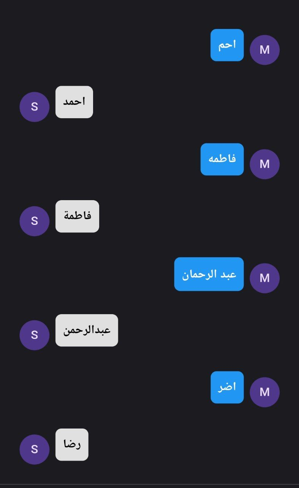

# Repo for highlights private repos
## ArabicNameCorrector

### Front-end
1 - flutter

### Back-end
1 - Dart  
2 - FLASK

### Models
1. The first model `Low-End` is fast but has lower accuracy compared to the others.

2. The second is seq2seq model `Medium` offers good accuracy with medium speed.

3. The third model `High-End` is slower but achieves very high accuracy; it combines three seq2seq models, each focusing on a specific part of the data while leveraging knowledge of the entire dataset.

### Examples 

*   **Input 1 & 2:** Low-End Model
*   **Input 3:** Medium Model
*   **Input 4:** High-End Model

